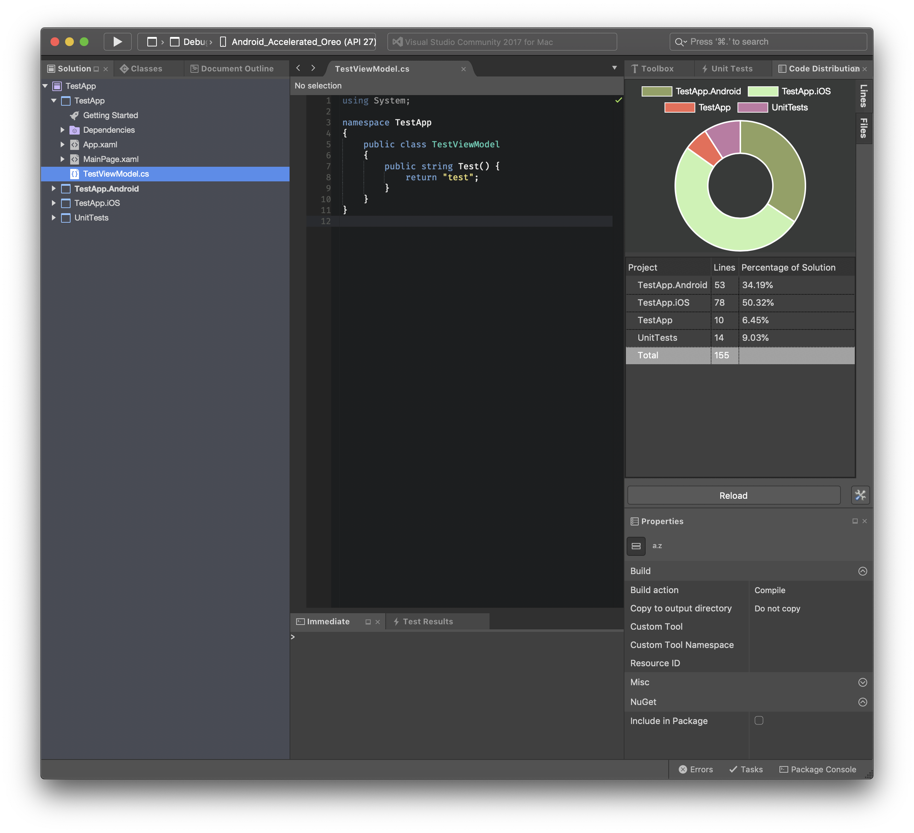

# VSMac-CodeDistribution

A Visual Studio for Mac extension that visually displays the distribution of code amongst all the projects in a given solution.

I have found this to be particularly useful when working with Xamarin projects in order to determine the volume of code that is shared between the target platforms.

## Installation

1. Open Visual Studio Extension Repository Manager via `Visual Studio -> Extensions... -> Gallery -> Repositories Dropdown -> Manage Repositories`.

2. Add `https://raw.githubusercontent.com/ademanuele/VSMac-Extensions/master/main.mrep` to your repository sources.

3. Back in extension manager, you should now be able to see the extension listed as "Code Distribution Extension". Select and press `install`.

4. Restart Visual Studio for Mac.

5. Done.

Any future updates to the extension should show up in the `Updates` tab of the Extension Manager.

## Usage

You can access the code distribution pad through `View -> Pads -> Code Distribution`.

The pad shows a breakdown of the line count and file types contained in any solution currently loaded in the workspace.

You can switch between seeing line count breakdown and file type breakdown using the tabs on the right hand side of the pad.

## Reporting Issues

If you find a bug or have a feature request, please report them at this repository's issues section.

## Support

If you like this tool and would like to support its development, you can...

## Authors

**Arthur Demanuele** - Author

## License

This project is licensed under the MIT License - [full details](LICENSE.md).
